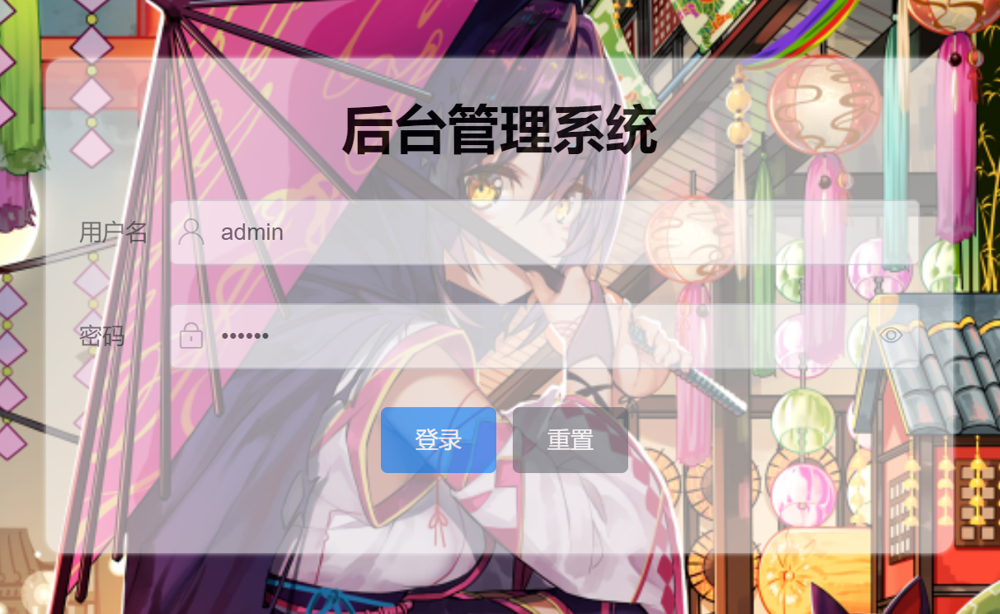
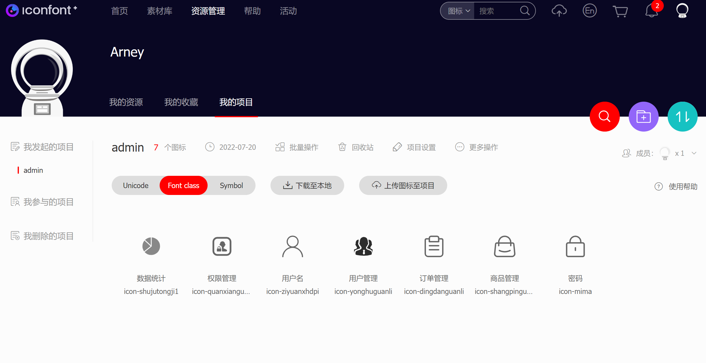
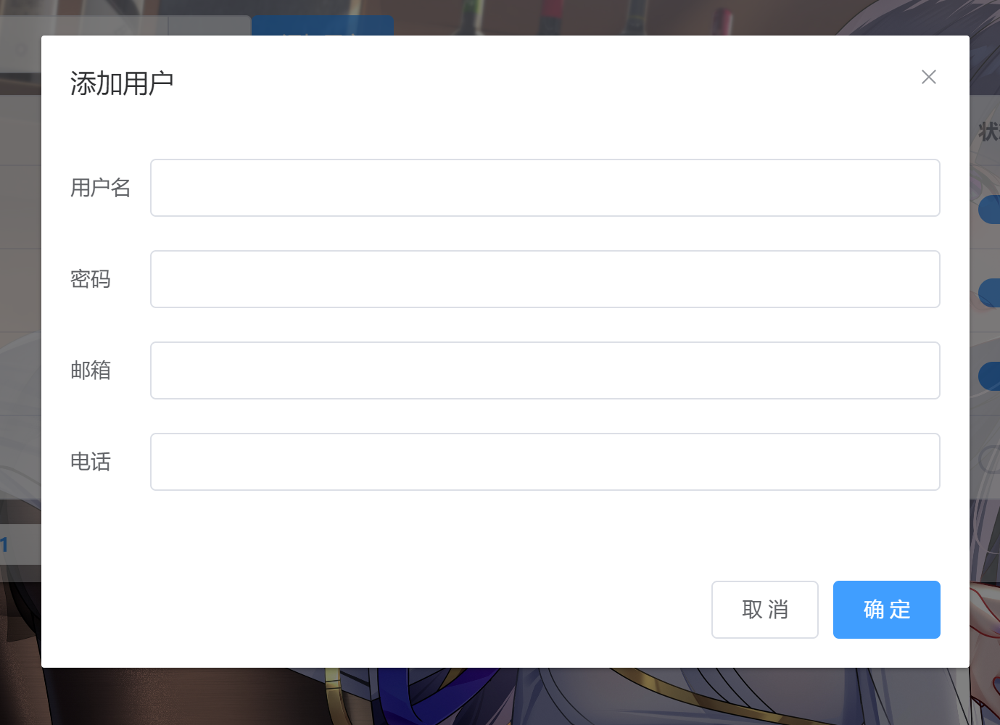
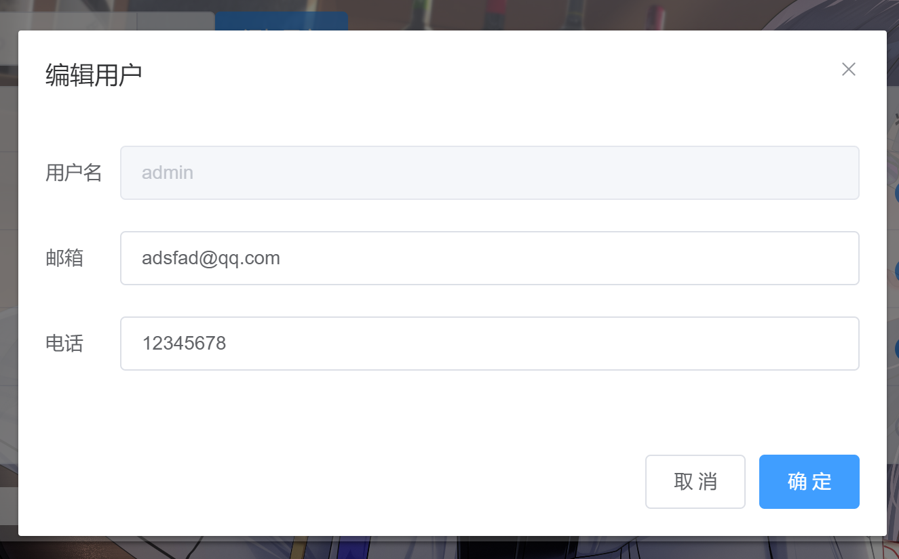
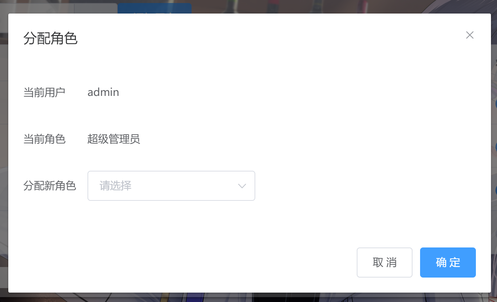
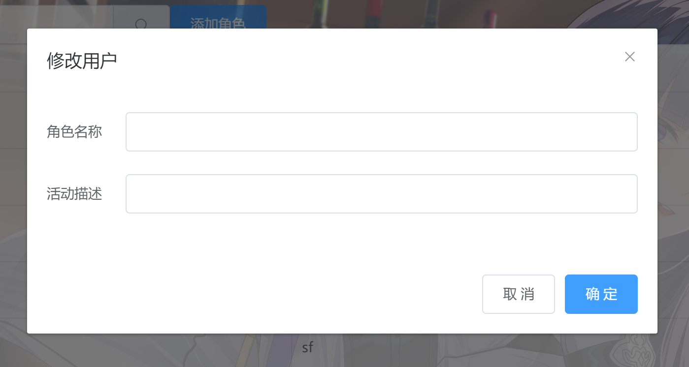
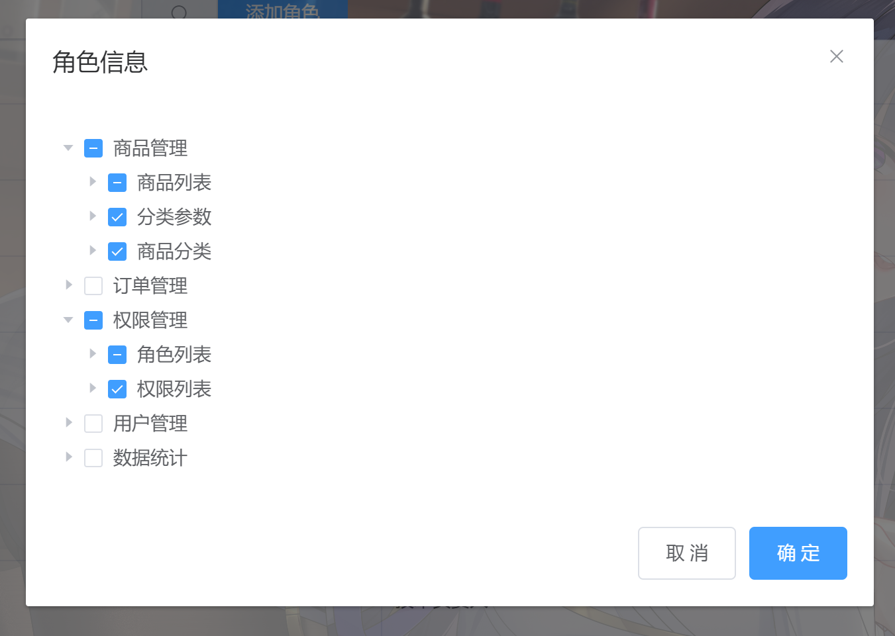
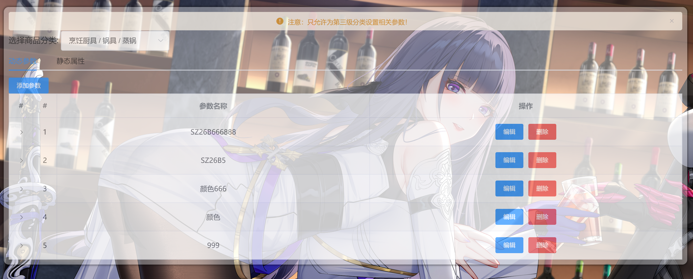
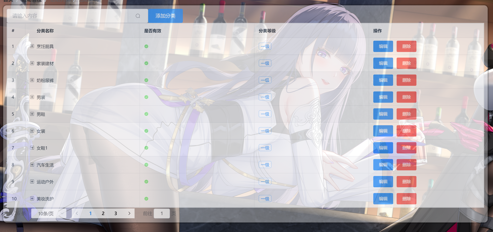

# 环境配置及所需要的插件

1. 脚手架:  Vue  CLI  v5.0.8  (使用Vue2搭建环境)

   ```javascript
   Vue CLI v5.0.8
   ? Please pick a preset: (Use arrow keys)
     Default ([Vue 3] babel, eslint)
    // 选择手动安装
     Default ([Vue 2] babel, eslint)
   (Move up and down to reveal more choices)
   // 手动选择需要安装的依赖
   Vue CLI v5.0.8
   ? Please pick a preset: Manually select features
   ? Check the features needed for your project: (Press <space> to select, <a> to toggle all, <i> to invert selection, and
   <enter> to proceed)
    (*) Babel //babel 对ES6/7/8/9转译成ES5
    ( ) TypeScript
    ( ) Progressive Web App (PWA) Support
    (*) Router // 路由
    (*) Vuex // vuex
   >(*) CSS Pre-processors // css预处理器
    (*) Linter / Formatter // 代码质量检测工具
    ( ) Unit Testing
    ( ) E2E Testing
    // 选择vue版本
   Vue CLI v5.0.8
   ? Please pick a preset: Manually select features
   ? Check the features needed for your project: Babel, Router, Vuex, CSS Pre-processors, Linter
   ? Choose a version of Vue.js that you want to start the project with
     3.x
   // 选择vue2 2.x版本
   > 2.x
   // 选择路由模式是否选择history模式非必要先择 N
   ? Use history mode for router? (Requires proper server setup for index fallback in production) (Y/n)
   // 选择css预处理器(Sass/SCSS (with dart-sass))
   ? Pick a CSS pre-processor (PostCSS, Autoprefixer and CSS Modules are supported by default): (Use arrow keys)
   > Sass/SCSS (with dart-sass)
     Less
     Stylus
   // 选择ESLint代码检查类型
   ? Pick a linter / formatter config: 
     ESLint with error prevention only 
     ESLint + Airbnb config 
   ❯ ESLint + Standard config   //ESLint代码质量检查工具
     ESLint + Prettier 
     
   // 代码检查时机，是保存，代码提交检查
   ? Pick additional lint features: 
   ❯◉ Lint on save   //代码保存时就检查
    ◯ Lint and fix on commit
   // 配置文件是否单独保存
   ? Where do you prefer placing config for Babel, ESLint, etc.? 
   ❯ In dedicated config files    //单独配置文件中
     In package.json 
    // 是否保存前面的所有配置
   ? Save this as a preset for future projects? (y/N) y  //是否保存前面的所有配置，保存时会起名
   ```

2. 安装需要的依赖

   ```javascript
   // 安装axios
     npm i axios
   // 安装element ui
     vue add element
   // 步骤：
      // 第一步：
      WARN  There are uncommitted changes in the current repository, it's recommended to commit or stash them first.
   ? Still proceed? (y/N) y //继续
   
    // 第二步：element ui导入方式
    
    ? How do you want to import Element? 
     Fully import  【全部导入】
   ❯ Import on demand  //按需导入，保证文件打包体积 【推荐】
   
   // 第三步：选择语言
   ? Choose the locale you want to load (Use arrow keys)
   ❯ zh-CN   //简体中文
     zh-TW 
     af-ZA 
     ar 
     bg 
     ca 
     cs-CZ
     
    // 第四步：等待安装完成
    
    
   ```

3. 运行项目

   ```javascript
   npm run serve
   ```

4. Axios的封装

   ```javascript
   // 引入axios
   import axios from 'axios'
   // 引入多环境配置
   import env from './env'
   // 引入elementui设置提示信息
   import { Message } from 'element-ui'
   const instance = axios.create({
   	// 设置基准地址
       baseURL: env.online.baseURL
       // 设置超时时间
       timeout: 1000,
   })
   // 设置请求拦截
   instance.interceptors.request.use(
       (config) => {
           console.log(config.url)
           //应该先配置loading,token
       	//此处省略.....
       	//如果不是登录接口，需要配置请求头，添加token
           if (config.url !== '/login') {
               config.headers.Authorization = window.localStorage.getItem('token')
           }
           return config
       },
       (error) => {
           alert(error)
       }
   )
   // 设置相应拦截
   instance.interceptors.response.use(
       (result) => {
       	// 将项目中可能成功返回的状态码保存为一个数组
           const success = [200, 201, 204]
           // 判断result返回的状态码是否在success中，如果在就提示成功，并返回结果
           if (success.includes(result.data.meta.status)) {
           	// 成功提示
               Message({
                   message: result.data.meta.msg,
                   type: 'success'
               })
                // 如果是登录成功，将登录返回的token保存到本地
               if (result.config.url == '/login') {
                   localStorage.setItem('token', result.data.data.token)
               }
           } else {
               Message({
                   message: result.data.meta.msg,
                   type: 'error'
               })
           }
           //返回成功后的数据
           return result.data
       },
       // 失败提示
       (error) => {
           alert(error)
       }
   )
   export default instance
   ```

5. ## Api封装(笔记　部分)

   ```js
   // 引入封装好的axios
   import api from './axios'
   export function getLoginInfo(data) {
       return api({
           // api路径
           url: '/login',
           // 请求方法
           method: 'POST',
           data
       })
   }
   ```

6. 多环境变量的封装

   ````javascript
   export default {
       // 本地接口
       local: {
           baseURL: 'http://XXXXX',
       },
       // 测试接口
       testing: {
           baseURL:'http://XXXXX',
       },
       // 线上接口
       online: {
           baseURL:'http://XXXXX',
       },
   }
   ````

7. ## Vue2富文本的使用(quill)

   1. 下载Vue-Quill-Editor  

      ```node
      npm install vue-quill-editor --save
      ```

   2. 下载quill（Vue-Quill-Editor需要依赖） 

      ```node
      npm install quill --save
      ```

   3. 使用(使用<quill-editor></quill-editor>标签)

      ```javascript
      <template>
          <div class="edit_container">
              <quill-editor 
                  v-model="content" 
                  ref="myQuillEditor" 
                  :options="editorOption" 
                  @blur="onEditorBlur($event)" @focus="onEditorFocus($event)"
                  @change="onEditorChange($event)">
              </quill-editor>
          </div>
      </template>
      <script>
      
      import { quillEditor } from "vue-quill-editor"; //调用编辑器
      import 'quill/dist/quill.core.css';
      import 'quill/dist/quill.snow.css';
      import 'quill/dist/quill.bubble.css';
      
      export default {
          components: {
          
              quillEditor
              
          },
          data() {
              return {
                  content: `<p></p><p><br></p><ol><li><strong><em>Or drag/paste an image here.</em></strong></li><li><strong><em>rerew</em></strong></li><li><strong><em>rtrete</em></strong></li><li><strong><em>tytrytr</em></strong></li><li><strong><em>uytu</em></strong></li></ol>`,
                  editorOption: {}
              }
          },
          methods: {
              onEditorReady(editor) { // 准备编辑器
       
              },
              onEditorBlur(){}, // 失去焦点事件
              onEditorFocus(){}, // 获得焦点事件
              onEditorChange(){}, // 内容改变事件
          },
          computed: {
              editor() {
                  return this.$refs.myQuillEditor.quill;
              },
          }
      }
      </script>
      ```

   4. 全局引入 

      在main.js里引入

      ```javascript
      import VueQuillEditor from 'vue-quill-editor'
      import 'quill/dist/quill.core.css'
      import 'quill/dist/quill.snow.css'
      import 'quill/dist/quill.bubble.css'
      Vue.use(VueQuillEditor)
      ```

   5. 自定义 toolbar 菜单

      ```javascript
      editorOption: {
                    placeholder: "请在这里输入",
                    modules:{
                      toolbar:[
                                ['bold', 'italic', 'underline', 'strike'],    //加粗，斜体，下划线，删除线
                                ['blockquote', 'code-block'],     //引用，代码块
                                [{ 'header': 1 }, { 'header': 2 }],        // 标题，键值对的形式；1、2表示字体大小
                                [{ 'list': 'ordered'}, { 'list': 'bullet' }],     //列表
                                [{ 'script': 'sub'}, { 'script': 'super' }],   // 上下标
                                [{ 'indent': '-1'}, { 'indent': '+1' }],     // 缩进
                                [{ 'direction': 'rtl' }],             // 文本方向
                                [{ 'size': ['small', false, 'large', 'huge'] }], // 字体大小
                                [{ 'header': [1, 2, 3, 4, 5, 6, false] }],     //几级标题
                                [{ 'color': [] }, { 'background': [] }],     // 字体颜色，字体背景颜色
                                [{ 'font': [] }],     //字体
                                [{ 'align': [] }],    //对齐方式
                                ['clean'],    //清除字体样式
                                ['image','video']    //上传图片、上传视频
                                ]
                            }
                      },
      ```

8. 时间过滤器(Moment.js)

   第一步安装Moment插件

   ```node
   npm install moment --save
   ```

   第二部mian.js全局引入

   ```javascript
   import moment from 'moment'
   ```

   第三步使用Moment过滤器

   ```javascript
   Vue.filter('year', function(time){
     let data = moment(time * 1000).format('YYYY-MM-DD  HH:mm:SS')
     return data
   })
   ```

9. ## 树形表格

   Use npm:

   ```shell
   npm i vue-table-with-tree-grid -S
   ```

   Or use yarn:

   ```shell
   yarn add vue-table-with-tree-grid
   ```

   ## Usage

   ```javascript
   import Vue from 'vue'
   import ZkTable from 'vue-table-with-tree-grid'
   
   Vue.use(ZkTable)
   ```

   Or

   ```javascript
   import Vue from 'vue'
   import ZkTable from 'vue-table-with-tree-grid'
   
   Vue.component(ZkTable.name, ZkTable)
   ```

   more information please see [example...](https://github.com/MisterTaki/vue-table-with-tree-gird/blob/master/example/Example.vue), or git clone this repository and open dev mode (I will give it a homepage later...).

   ## API

   ### Table Attributes

   | 属性            | 说明                                                         | 类型             | 参数                               | 默认值     |
   | --------------- | ------------------------------------------------------------ | ---------------- | ---------------------------------- | ---------- |
   | data            | 表格各行的数据                                               | Array            | -                                  | []         |
   | empty-text      | 表格数据为空时显示的文字                                     | String           | -                                  | '暂无数据' |
   | columns         | 表格各列的配置（具体见下文：Columns Configs）                | Array            | -                                  | []         |
   | show-header     | 是否显示表头                                                 | Boolean          | -                                  | true       |
   | show-index      | 是否显示数据索引                                             | Boolean          | -                                  | false      |
   | index-text      | 数据索引名称                                                 | String           | -                                  | '序号'     |
   | show-summary    | 是否显示表尾合计行                                           | Boolean          | -                                  | false      |
   | sum-text        | 表尾合计行首列名称                                           | String           | -                                  | '合计'     |
   | summary-method  | 表尾合计行计算方法                                           | Function         | data, column, columnIndex          | -          |
   | max-height      | 最大高度                                                     | [String, Number] | -                                  | 'auto'     |
   | stripe          | 是否显示间隔斑马纹                                           | Boolean          | -                                  | false      |
   | border          | 是否显示纵向边框                                             | Boolean          | -                                  | false      |
   | show-row-hover  | 鼠标悬停时，是否高亮当前行                                   | Boolean          | -                                  | true       |
   | tree-type       | 是否为树形表格                                               | Boolean          | -                                  | false      |
   | children-prop   | 树形表格中遍历的属性名称                                     | String           | -                                  | 'children' |
   | is-fold         | 树形表格中父级是否默认折叠                                   | Boolean          | -                                  | true       |
   | expand-type     | 是否为展开行类型表格（为 True 时，需要添加名称为 '$expand' 的[作用域插槽](https://cn.vuejs.org/v2/guide/components.html#作用域插槽), 它可以获取到 row, rowIndex) | Boolean          | -                                  | false      |
   | selection-type  | 是否为多选类型表格                                           | Boolean          | -                                  | false      |
   | row-key         | 行数据的 Key，用来优化 Table 的渲染                          | Function         | row, rowIndex                      | rowIndex   |
   | row-class-name  | 额外的表格行的类名                                           | String, Function | row, rowIndex                      | -          |
   | cell-class-name | 额外的表格行的类名                                           | String, Function | row, rowIndex, column, columnIndex | -          |
   | row-style       | 额外的表格行的样式                                           | Object, Function | row, rowIndex                      | -          |
   | cell-style      | 额外的表格单元格的样式                                       | Object, Function | row, rowIndex, column, columnIndex | -          |

   ### Columns Configs

   | 属性        | 说明                                                         | 类型             | 默认值 |
   | ----------- | ------------------------------------------------------------ | ---------------- | ------ |
   | label       | 列标题名称                                                   | String           | ''     |
   | prop        | 对应列内容的属性名                                           | String           | ''     |
   | align       | 对应列内容的对齐方式，可选值有 'center', 'right'             | String           | 'left' |
   | headerAlign | 对应列标题的对齐方式，可选值有 'center', 'right'             | String           | 'left' |
   | width       | 列宽度                                                       | [String, Number] | 'auto' |
   | minWidth    | 列最小宽度                                                   | [String, Number] | '80px' |
   | type        | 列类型，可选值有 'template'(自定义列模板)                    | String           | ''     |
   | template    | 列类型为 'template'(自定义列模板) 时，对应的[作用域插槽](https://cn.vuejs.org/v2/guide/components.html#作用域插槽)（它可以获取到 row, rowIndex, column, columnIndex）名称 | String           | ''     |

   ### Table Events

   | 事件名            | 说明                       | 参数                                       |
   | ----------------- | -------------------------- | ------------------------------------------ |
   | cell-click        | 单击某一单元格             | row, rowIndex, column, columnIndex, $event |
   | cell-dblclick     | 双击某一单元格             | row, rowIndex, column, columnIndex, $event |
   | cell-contextmenu  | 在某一单元格上点击鼠标右键 | row, rowIndex, column, columnIndex, $event |
   | cell-mouseenter   | 鼠标滑入某一单元格         | row, rowIndex, column, columnIndex, $event |
   | cell-mouseleave   | 鼠标滑出某一单元格         | row, rowIndex, column, columnIndex, $event |
   | row-click         | 单击某一行                 | row, rowIndex, $event                      |
   | row-dblclick      | 双击某一行                 | row, rowIndex, $event                      |
   | row-contextmenu   | 在某一行上点击鼠标右键     | row, rowIndex, $event                      |
   | row-mouseenter    | 鼠标滑入某一行             | row, rowIndex, $event                      |
   | row-mouseleave    | 鼠标滑出某一行             | row, rowIndex, $event                      |
   | checkbox-click    | 鼠标单击checkbox           | row, rowIndex, $event                      |
   | tree-icon-click   | 鼠标单击树形icon           | row, rowIndex, $event                      |
   | expand-cell-click | 鼠标单击展开单元格         | row, rowIndex, $event                      |

   ### Table Methods

   | 方法名         | 说明                                                         | 参数 |
   | -------------- | ------------------------------------------------------------ | ---- |
   | getCheckedProp | 当表格为多选类型表格时，用于获取当前所选项的属性，返回一个数组；属性默认为'index'。 | prop |

   代码:

   ````vue
   <template>
       <div class="categories">
           <zk-table ref="table" class="tb-cate" index-text="#" show-index stripe border :data="tableData" :columns="columns" :expand-type="false" :selection-type="false">
               <template slot="valid" scope="scope">
                   <i class="el-icon-success" v-if="!scope.row.cat_deleted" style="color: lightGreen"></i>
                   <i class="el-icon-error" v-else style="color: red"></i>
               </template>
               <template slot="level" scope="scope">
                   <el-tag type="primary" effect="plain" size="mini" v-show="scope.row.cat_level == 0">一级</el-tag>
                   <el-tag type="success" effect="plain" size="mini" v-show="scope.row.cat_level == 1">二级</el-tag>
                   <el-tag type="warning" effect="plain" size="mini" v-show="scope.row.cat_level == 2">三级</el-tag>
               </template>
               <template slot="operate" scope="scope">
                   <el-button type="primary" @click="handleEdit(scope.row)">编辑</el-button>
                   <el-button type="danger" @click="handleDelete(scope.row)">删除</el-button>
               </template>
           </zk-table>
       </div>
   </template>
   <script>
       import { getCategories } from '../../utils/api.js'
       export default {
           data() {
               return {
                   columns: [
                       { label: "分类名称", prop: "cat_name" },
                       {
                           label: "是否有效",
                           prop: "cat_deleted",
                           type: "template",
                           template: "valid",
                       },
                       {
                           label: "分类等级",
                           prop: "cat_level",
                           type: "template",
                           template: "level"
                       },
                       {
                           label: '操作',
                           type: 'template',
                           template: 'operate'
                       }
                   ],
                   tableData: [],
               };
           },
           methods: {
               async render() {
                   let res = await getCategories()
                   console.log(res);
                   this.tableData = res.data
               }
           },
           created() {
               this.render()
           }
       };
   </script>
   ````

10. 路由守卫

    ```javascript
    router.beforeEach((to, from, next) => {
      document.title = to.meta.title;
      // 判断本地是否存在token
      let token = localStorage.getItem('token')
      if(token){
        // 若果有则进行路由跳转
        next()
      }else{
        // 否则如果路径在登录页面进行跳转否则返回登录页面
        if(to.path == '/LoginPage'){
          next()
        }else{
          next("/LoginPage")
        }
      }
    })
    ```

# 一、登录页面

1. 简单布局

   

2. 手动配置用户名和密码框进行正则验证

3. 点击登录验证成功调用接口进行跳转

4. 将接口中的token存储在本地存储中使其它页面可以使用

5. 进行路由守卫

   ```javascript
   router.beforeEach((to, from, next) => {
     document.title = to.meta.title;
     // 判断本地是否存在token
     let token = localStorage.getItem('token')
     if(token){
       // 若果有则进行路由跳转
       next()
     }else{
       // 否则如果路径在登录页面进行跳转否则返回登录页面
       if(to.path == '/LoginPage'){
         next()
       }else{
         next("/LoginPage")
       }
     }
   })
   ```

# 二、首页

1. 简单布局

   

2. 使用element实现布局容器

3. 配置头部Logo以及退出按钮

4. 使用element-ui NavMenu 导航菜单配置左侧菜单栏

5. 请求接口对左侧菜单栏进行渲染

6. 使用NavMenu 导航菜单的属性对左侧菜单栏进行展开与收起

   ```javascript
   // 使用该属性展开与隐藏
   :collapse="isCollapse"
   data() {
         return {
           isCollapse: true
         };
       },
   ```

7. 使用本地字体图标      [阿里图标库](https://www.iconfont.cn/)

   

   * 把字体图标下载到本地

   * 将解压好的字体图标放到assets文件夹

   * ```javascript
     // 引入本地字体图标
     import './assets/icon/iconfont.css'
     ```

   * ```html
     <--使用--!>
     <i class="iconfont icon-ziyuanxhdpi"></i>
     ```

8. 点击退出登录按钮清除token并返回登录页面

9. 解决页面刷新导航栏不高亮问题

   ```javascript
    data() {
               return {
                  	// 声明一个变量
                   pathIndex: '',
               }
           },
   // 对路由进行监听
   watch: {
               $route: {
                   // 开启深度监听
                   deep: true,
                   // 页面进入时立即监听
                   immediate: true,
                   handler(val) {
                       this.pathIndex = val.matched[1].name
                   }
               }
           },
   ```

10. NavMenu 导航菜单开启路由模式进行路由跳转，内容区域放入一个坑（<router-view></router-view>）用来配置子路由

# 三、用户列表

1. 简单布局

   

   

   

   

2. 对面包屑进行封装

   ```vue
   <template>
       <div>
           <el-breadcrumb separator-class="el-icon-arrow-right">
               <el-breadcrumb-item :to="{ path: '/' }">首页</el-breadcrumb-item>
               <el-breadcrumb-item>{{level1}}</el-breadcrumb-item>
               <el-breadcrumb-item>{{level2}}</el-breadcrumb-item>
           </el-breadcrumb>
       </div>
   </template>
   
   <script>
       export default {
           props: {
               level1: {
                   type: String,
                   default: '管理'
               },
               level2: {
                   type: String,
                   default: '列表'
               }
           },
       }
   </script>
   // 组件内使用
   <MBX level1="订单管理" level2="订单列表"></MBX>
   ```

   

3. 使用element-ui实现输入框添加按钮以及表格

4. 请求用户列表接口数据将返回的数据渲染到页面表格上

5. 点击添加按钮弹出弹出框，弹出框的表单内容进行手动验证

6. 验证通过将表单中的数据传入到接口中实现添加功能

7. 编辑，删除，分配权限使用插槽

8. 点击编辑通过slot-scrope获取整行内容实现数据的回填，点击确定按钮请求编辑的数据接口实现编辑功能

9. 点击删除获取本行用户的id传入到接口实现删除功能

10. 点击分配权限按钮获取权限列表内容实现下拉框权限列表内容，通过分配权限接口实现分配权限的功能

11. 分页功能的实现

    ```javascript
    <el-pagination
    	// pageSize 改变时会触发
          @size-change="handleSizeChange"
    	// currentPage 改变时会触发
          @current-change="handleCurrentChange"
          :current-page="currentPage4"
    	// 每页显示个数选择器的选项设置
          :page-sizes="[100, 200, 300, 400]"
    	// 每页显示条目个数
          :page-size="100"
    	// 组件布局，子组件名用逗号分隔
          layout="total, sizes, prev, pager, next, jumper"
       // 总条目数
          :total="400">
        </el-pagination>
    
     methods: {
          handleSizeChange(val) {
            console.log(`每页 ${val} 条`);
          },
          handleCurrentChange(val) {
            console.log(`当前页: ${val}`);
          }
     },
    ```

# 四、角色列表

1. 简单布局

   

   

   

2. 请求角色列表的数据渲染到页面表格

3. 编辑功能和删除功能同上获取所需要的参数传递到接口中实现

4. 点击角色修改按钮显示弹出框并实现树形控件

   ```vue
   <!-- 
         1.data:数据源
         2.show-checkbox:显示复选框
         3. node-key:代表tree组件唯一标识
         4.default-expanded-keys：默认展开id数组
         5.default-checked-keys：默认选中项id组成的数组集合
         6.props:tree组件默认配置项
         7.default-expand-all:是否默认全部展开
        -->
   <el-tree
     :data="data"
     show-checkbox
     node-key="id"
     :default-expanded-keys="[2, 3]"
     :default-checked-keys="[5]"
     :props="defaultProps">
   </el-tree>
   defaultProps: {
   	// 接口子节点
        children: 'children',
   	// 节点名称
        label: 'authName'
   },
   async addReviseUser() {
   // 若节点可被选择（即 show-checkbox 为 true），则返回目前被选中的节点的 key 所组成的数组
                   let CheckedTree = this.$refs.tree.getCheckedKeys();
   // 若节点可被选择（即 show-checkbox 为 true），则返回目前半选中的节点的 key 所组成的数组
                   let HalfCheckedTree = this.$refs.tree.getHalfCheckedKeys()
   // 需要的参数进行拼接
                   let data = {
                       id: this.treeId,
                       rids: [...CheckedTree, ...HalfCheckedTree].join(',')
                   }
                   await treeUserList(data)
                   this.reviseRole = false
                   this.render()
               },
   ```

5. 使用递归实现权限的回填

   - 调用树形权限接口将所有权限数据渲染到tree组件中

     - 打开对话框时调用树形权限接口

   - 将该角色所拥有的权限处于默认选中状态

     - tree组件选中状态：全选状态和半选状态

     - 如何获取选中项的id组成一个数组呢？？？？

       - 主要思路通过递归获取当前角色所拥有的权限id数组

   ```javascript
   recurrence(row, key) {
                   if (!row.children) {
                       return key.push(row.id)
                   }
                   row.children.forEach(item => {
                       this.recurrence(item, key)
                   })
               },
   ```

   

# 五、权限列表

1. 简单布局

   

2. 使用element-ui 实现表格布局

3. 请求接口获取权限列表的相互渲染到页面上

# 六、商品列表

1. 简单布局

   

2. 请求商品列表的接口将商品列表中的数据渲染到页面上

3. 创建时间通过过滤器Moment.js实现 YYYY-MM-DD  HH:mm:SS 的时间形式

   ````node+js
   // 安装moment.js插件
   npm install moment --save 
   // main.js里面引入插件
   import moment from 'moment'
   // 使用filter过滤器
   Vue.filter('year', function(time){
     let data = moment(time * 1000).format('YYYY-MM-DD  HH:mm:SS')
     return data
   })
   ````

4. 删除功能通过获取id传参实现删除功能

## 商品添加功能

1. 点击添加商品跳转到商品添加页面

2. 商品页面简单布局

   

   

   

   

   

3. 使用element-ui手动实现表单内容完成基本布局

4. 对表单中的内容进行正则验证，判空处理

5. 如果级联选择器中的数据不是三级的化进行组织进行处理

6. 商品参数，商品属性通过many, only获取参数的属性拼接获取到所需要的数据当中进行渲染

7. 图片上传功能, 图片功能不能使用axios所以将路径直接放到action中

   ```vue
   <el-upload
     class="upload-demo"
     drag
     action="https://jsonplaceholder.typicode.com/posts/"
     multiple>
     <i class="el-icon-upload"></i>
     <div class="el-upload__text">将文件拖到此处，或<em>点击上传</em></div>
     <div class="el-upload__tip" slot="tip">只能上传jpg/png文件，且不超过500kb</div>
   </el-upload>
   ```

   因为不能使用axios所以token要在获取一次,通过headers来获取token

   ```
   headers: {
                       Authorization: window.localStorage.getItem("token"),
                   },
   ```

8. 商品内容因为element-ui没有富文本组件所以我们使用插件来实现富文本的功能

9. Vue2富文本的使用(quill)

   1. 下载Vue-Quill-Editor  

      ```node
      npm install vue-quill-editor --save
      ```

   2. 下载quill（Vue-Quill-Editor需要依赖） 

      ```node
      npm install quill --save
      ```

   3. 使用(使用<quill-editor></quill-editor>标签)

      ```javascript
      <template>
          <div class="edit_container">
              <quill-editor v-model="content">			</quill-editor>
          </div>
      </template>
      <script>
      export default {
          data() {
              return {
                  content: '',
              }
          },
          methods: {
              onEditorReady(editor) { // 准备编辑器
       
              },
              onEditorBlur(){}, // 失去焦点事件
              onEditorFocus(){}, // 获得焦点事件
              onEditorChange(){}, // 内容改变事件
          },
          computed: {
              editor() {
                  return this.$refs.myQuillEditor.quill;
              },
          }
      }
      </script>
      ```
      
      在main.js里引入
      
      ```javascript
      import VueQuillEditor from 'vue-quill-editor'
      import 'quill/dist/quill.core.css'
      import 'quill/dist/quill.snow.css'
      import 'quill/dist/quill.bubble.css'
      Vue.use(VueQuillEditor)
      ```
   
10. 点击添加按钮对参数进行处理请求添加商品接口实现商品的添加功能添加成功则跳转到商品列表页面

# 七、分类参数

1. 简单布局

   

2. 如果商品分类不是三级则添加按钮为禁用状态

3. 通过only和many请求参数列表实现动态参数和静态参数

4. 添加，编辑，删除功能实现方法同上传入需要的参数请求接口实现功能

5. 对本行数据进行处理请求接口用来实现添加参数的属性

# 八、商品分类

1. 简单布局

   

2. 本页面使用树形控件来实现页面的展示

   npm安装插件:

   ```shell
   npm i vue-table-with-tree-grid -S
   ```

   全局引入并使用树形控件

   ```javascript
   import Vue from 'vue'
   import ZkTable from 'vue-table-with-tree-grid'
   
   Vue.use(ZkTable)
   ```

   代码:

   ````vue
   <template>
       <div class="categories">
           <zk-table ref="table" class="tb-cate" index-text="#" show-index stripe border :data="tableData" :columns="columns" :expand-type="false" :selection-type="false">
               <template slot="valid" scope="scope">
                   <i class="el-icon-success" v-if="!scope.row.cat_deleted" style="color: lightGreen"></i>
                   <i class="el-icon-error" v-else style="color: red"></i>
               </template>
               <template slot="level" scope="scope">
                   <el-tag type="primary" effect="plain" size="mini" v-show="scope.row.cat_level == 0">一级</el-tag>
                   <el-tag type="success" effect="plain" size="mini" v-show="scope.row.cat_level == 1">二级</el-tag>
                   <el-tag type="warning" effect="plain" size="mini" v-show="scope.row.cat_level == 2">三级</el-tag>
               </template>
               <template slot="operate" scope="scope">
                   <el-button type="primary" @click="handleEdit(scope.row)">编辑</el-button>
                   <el-button type="danger" @click="handleDelete(scope.row)">删除</el-button>
               </template>
           </zk-table>
       </div>
   </template>
   <script>
       import { getCategories } from '../../utils/api.js'
       export default {
           data() {
               return {
                   columns: [
                       { label: "分类名称", prop: "cat_name" },
                       {
                           label: "是否有效",
                           prop: "cat_deleted",
                           type: "template",
                           template: "valid",
                       },
                       {
                           label: "分类等级",
                           prop: "cat_level",
                           type: "template",
                           template: "level"
                       },
                       {
                           label: '操作',
                           type: 'template',
                           template: 'operate'
                       }
                   ],
                   tableData: [],
               };
           },
           methods: {
               async render() {
                   let res = await getCategories()
                   console.log(res);
                   this.tableData = res.data
               }
           },
           created() {
               this.render()
           }
       };
   </script>
   ````

3. 添加功能实现判断分类等级来判断是否为父级分类

   ```javascript
   // 判断级联选择其中的id长度如果为0
   if (this.classId.length == 0) {
   					// 则cat_id和cat_level = 0
   					为父级分类
                       this.ruleForm.cat_pid = 0
                       this.ruleForm.cat_level = 0
                   } else if (this.classId.length == 1) {
                       this.ruleForm.cat_pid = this.classId[0]
                       this.ruleForm.cat_level = 1
                   } else if (this.classId.length == 2 || this.classId.length == 3) {
                       this.ruleForm.cat_pid = this.classId[1]
                       this.ruleForm.cat_level = 2
                   }
                   this.$refs.remain.dropDownVisible = false
   ```

   

# 九、订单列表

1. 简单布局

   

2. 请求订单列表的数据实现表格的渲染

3. 下单时间使用过滤器进行处理YYY-MM-DD  HH:mm:SS 的时间形式

   

# 十、数据统计

1. 简单布局

   

2. npm安装echarts

   ```
   npm install echarts --save
   ```

3. 引用echarts

   ```
   import * as echarts from 'echarts';
   Vue.prototype.$echarts = echarts; 
   ```

4. ```javascript
   import * as echarts from 'echarts'
       import { getReports } from '../../utils/api.js'
       export default {
           data() {
               return {
                   // 需要合并的公用数据
                   preData: {
                       tooltip: {
                           trigger: 'axis',
                           axisPointer: {
                               type: 'cross',
                               label: {
                                   backgroundColor: '#E9EEF3'
                               }
                           }
                       },
                       grid: {
                           left: '3%',
                           right: '4%',
                           bottom: '3%',
                           containLabel: true
                       },
                       xAxis: [{
                           boundaryGap: false
                       }],
                       yAxis: [{
                           type: 'value'
                       }]
                   }
               };
           },
           methods: {
               canvas() {
                   // 获取canvas的节点
                   let canvas = document.querySelector('#canvas')
                   console.log(canvas);
                   // 初始化echarts
                   let myChart = echarts.init(canvas)
                   // 获取接口内容
                   getReports().then(res => {
                       console.log(res);
                       // 合并数据
                       let mergeData = { ...this.preData, ...res.data }
                       let options = mergeData
                       myChart.setOption(options)
                   })
               }
           },
           mounted() {
               this.canvas()
           },
   ```

# 十一项目打包

#### 首先在 vue 的项目下面 新建一个 vue.config.js 该文件夹和src是同级的文件夹。

文件夹的内容如下

```javascript
module.exports = {
  publicPath: "./", // 部署应⽤包时的基本 URL
  outputDir: "dist", // npm run build ⽣成的⽂件夹，默认是dist
  assetsDir: "static", // 在kaixin⽂件夹下⾯⽣成static⽬录存放js,img,css等静态资源
  indexPath: "index.html", // ⽣成的单⽂件的，⽂件名，
  filenameHashing: true, // 文件名哈希（默认情况下，生成的静态资源在它们的文件名中包含了 hash 以便更好的控制缓存。然而，这也要求 index 的 HTML 是被 Vue CLI 自动生成的。如果你无法使用 Vue CLI 生成的 index HTML，你可以通过将这个选项设为 false 来关闭文件名哈希）
  pages: {
    open: true, // 是否直接在浏览器打开。
    index: {
      // page 的入口文件
      entry: 'src/index/main.js',
      // 模板文件
      template: 'public/index.html',
      // 在 dist/index.html 的输入文件
      filename: 'index.html',
      // 当使用页面 title 选项时，
      // template 中的 title 标签需要的是 <title><%= htmlWebpackPlugin.options.title %></title>
      title: 'Index Page',
      // 在这个页面中包含的块，默认情况下会包含
      // 提取出来的通用 chunk 和 vandor chunk。
      chunks: ['chunk-vendors', 'chunk-common', 'index']
    },
    // 当使用只有入口的字符串格式时，
    // 模板文件默认是 'public/subpage.html'
    // 如果不存在，就回退到 'public/index.html'
    // 输出文件默认是 'subpage.html'
    subpage: 'src/subpage/main.js'
  },
  // 是否在保存的时候使用'eslint-loaer'进行检查。
  lintOnSave: true,
  // 是否使用带有浏览器内编译器的完整构建版本
  runtimeCompiler: false,
  // 在生成的 HTML 中的 <link rel="stylesheet"> 和 <script> 标签上启用 Subresource Integrity (SRI)。如果你构建后的文件是部署在 CDN 上的，启用该选项可以提供额外的安全性。
  integrity: true,
  // 配置跨域服务代理
  devServer: {
    host: "127.0.0.1", // 配置主机地址
    port: process.env.NODE_ENV == 'production' ? 3000 : 8888, // 配置运⾏的端⼝
    // proxy: "接⼝地址",  跨域代理！ 【重要！】
    proxy: { // 配置多个！
      // '/api': {
      //   target: 'http://localhost:3030/api',
      //   ws: true, // 跨域地址是https协议！
      //   changeOrigin: true,
      //   pathRewrite: {
      //     "^/api": ""   // 将 '/api' 替换成 ''  
      //   }
      // }
    },
  },
  css: {
    // 将组件内的 CSS 提取到一个单独的 CSS 文件 (只用在生产环境中)
    // 也可以是一个传递给 `extract-text-webpack-plugin` 的选项对象
    extract: true,
    // 是否开启 CSS source map？
    sourceMap: false,
    // 为预处理器的 loader 传递自定义选项。比如传递给
    // Css-loader 时，使用 `{ Css: { ... } }`。
    loaderOptions: {
      css: {
        // 这里的选项会传递给 css-loader
      },
      postcss: {
        // 这里的选项会传递给 postcss-loader
      }
    },
    // 为所有的 CSS 及其预处理文件开启 CSS Modules。
    // 这个选项不会影响 `*.vue` 文件。
    modules: false
  },
}
```

#### 